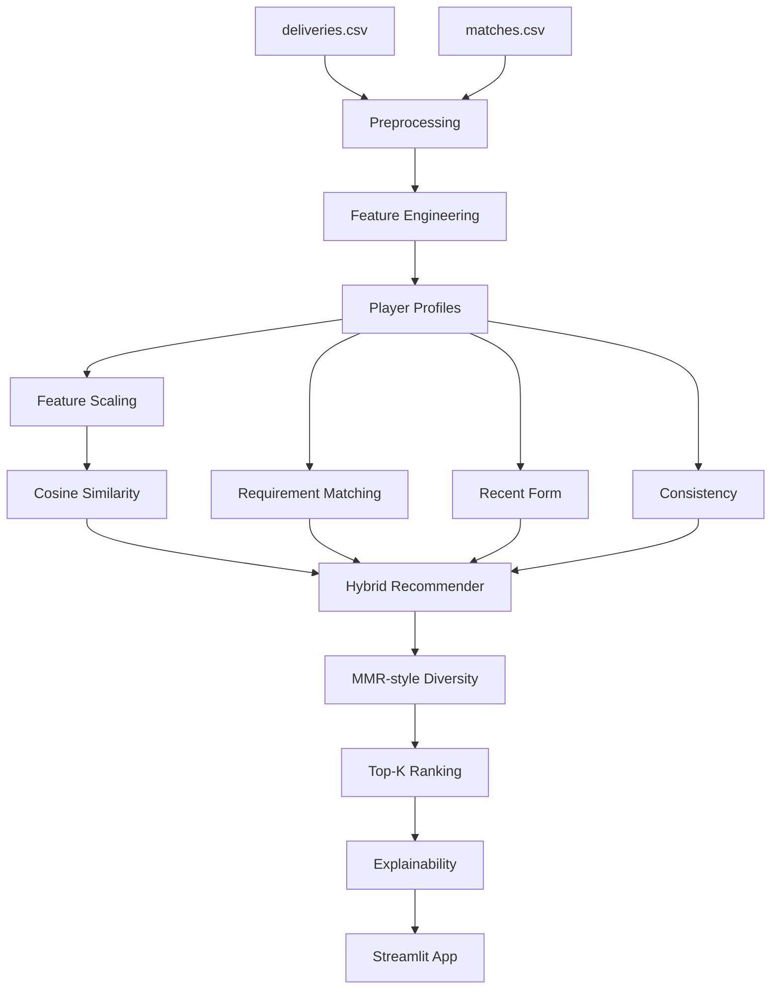

# 🏏AuctionIQ — A Hybrid Personalized IPL Auction Player Recommendation System

AuctionIQ is an end-to-end Python recommender system that uses historical IPL delivery and match data to answer:

> **Which player best fits my team's current requirements?**

This is deliberately a **recommender-system project**, not a large data-engineering platform.

## Core recommender concepts

- Content-Based Filtering
- Cosine Similarity
- Player-to-Player Similarity
- Team Requirement Matching
- Constraint-Aware Filtering
- Hybrid Recommendation
- Top-K Ranking
- Diversity-Aware Re-ranking (MMR-style)
- Cold-Start Handling
- Explainable Recommendations
- Offline Evaluation

## Data actually available

The supplied data contains:

- `deliveries.csv`: 260,920 ball-by-ball records
- `matches.csv`: 1,095 match-level records
- Seasons from 2007/08 through 2024
- 732 unique players observed through batting/bowling participation

The data does **not** provide:

- auction/base/sold prices
- player nationality
- official player roles
- current squads
- auction bidding history
- actual user ratings

Therefore AuctionIQ does not fabricate any of these fields.

### Budget handling

The Streamlit UI allows a user to enter a budget preference for the demo, but it is explicitly **not used as a factual price filter** because there is no auction-price column. To make budget a true hard constraint, supply a manually curated price table.

### Role handling

Roles are inferred from transparent workload/statistical rules in `src/feature_engineering.py`. These are analytical labels, not official player roles.

## Architecture



## Project structure

```text
AuctionIQ/
├── data/
│   ├── deliveries.csv
│   └── matches.csv
├── notebooks/
│   └── recommender_analysis.ipynb
├── src/
│   ├── data_loader.py
│   ├── preprocessing.py
│   ├── feature_engineering.py
│   ├── player_profiles.py
│   ├── content_based.py
│   ├── similarity.py
│   ├── collaborative.py
│   ├── hybrid_recommender.py
│   ├── ranking.py
│   ├── explainability.py
│   ├── evaluation.py
│   └── config.py
├── app.py
├── requirements.txt
├── README.md
└── .gitignore
```

## Install and run

```bash
python -m venv .venv
source .venv/bin/activate
pip install -r requirements.txt
streamlit run app.py
```

## Recommendation flow

1. Load and clean IPL data.
2. Build player-level batting, bowling, phase, recent-form and consistency features.
3. Scale profile vectors.
4. Compute cosine similarity.
5. Convert team requirements into a preference profile.
6. Apply supported constraints and compatibility rules.
7. Compute hybrid score.
8. Re-rank for diversity.
9. Return Top-K recommendations.
10. Explain the result from actual score components.


These weights are intentionally configurable. They should be compared with offline experiments rather than treated as universal truth.


### By

**Ahad**  
>> **Thiagarajar College of Engineering, Madurai<br>
    Developed as an Academic Mini Project<br>**
